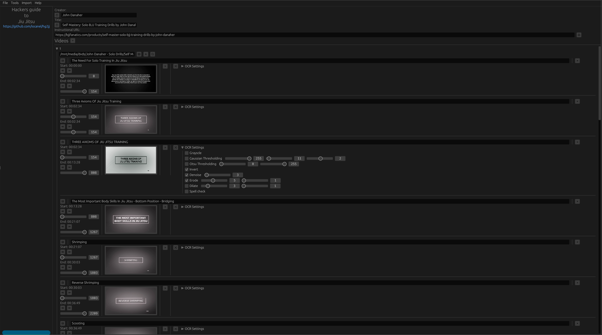

# Hackers Guide to Jiu Jitsu: The Application

A tool watching and navigating Jiu Jitsu instructionals.

 

### Features:

- Scene detection
- Scene title recognition (OCR)
- Download scene info (title & timestamps) from BJJ Fanatics
- Load / Save instructional information in org-mode format
- Generate m3u playlist
- Playback
- Customization
  - Timestamps
  - OCR preprocessing 

### Rationale

Jiu Jitsu instructionals can exceed 10 hours in duration that are usually spread from 5 to 8 video files on avarage and may contains hundrends of scenes/topics.
For the obvious reasons, they cannot be watched in one go. Instead it's preferable to watch them in chunks and ideally
itersperse training sessions between viewings. 

So, getting back to a particular topic, is not trivial. It should be!

This tool splits instructionals into pieces and makes it easier for you to find what you are looking for.

### Inspiration

A couple of months ago I started writing a series of blog posts called `Hackers Guide to Jiu Jitsu` that discussed about tools, scripts and tips for getting the most out of 
instructionals. While shell scripts work, they lack visualization and are hard to tune. A graphical user interface solves both problems.

If you are interested in the posts that I've written so far:

- 01. Hackers guide to Jiu Jitsu: intro [wordpress version](https://iocanel.com/2021/08/hackers-guide-to-jiu-jitsu)  [github version](https://github.com/iocanel/blog/tree/master/hackers-guide-to-jiu-jitsu-01-intro)
- 02. Hackers guide to Jiu Jitsu: ffmpeg [wordpress version](https://iocanel.com/2021/08/hackers-guide-to-jiu-jitsu-ffmpeg) [github version](https://github.com/iocanel/blog/tree/master/hackers-guide-to-jiu-jitsu-02-ffmpeg)
- 03. Hackers guide to Jiu Jitsu: mplayer [wordpress version](https://iocanel.com/2021/08/hackers-guide-to-jiu-jitsu-mplayer) [github version](https://github.com/iocanel/blog/tree/master/hackers-guide-to-jiu-jitsu-03-mplayer)
- 04. Hackers guide to Jiu Jitsu: markdown wiki [wordpress version](https://iocanel.com/2021/08/hackers-guide-to-jiu-jitsu-markdown-wiki) [github version](https://github.com/iocanel/blog/tree/master/hackers-guide-to-jiu-jitsu-04-markdown-wiki)
- 05. Hackers guide to Jiu Jitsu: flowcharts [wordpress version](https://iocanel.com/2022/01/hackers-guide-to-jiu-jitsu-flowcharts) [github version](https://github.com/iocanel/blog/tree/master/hackers-guide-to-jiu-jitsu-05-flowcharts)


### Running

There are multiple ways to run the application. Due to the large number of dependencies which is a bit tricky to get right, it's recommended to run `hg2jj` [as a docker container](#as-a-docker-container).
Still, you can build it locally and run it [as a desktop applicatin](#as-a-desktop-application).

#### As a docker container

The easiest way to run `hg2jj` is using docker. A helper script has been provided to run the container with all required parameters.

```sh
./scripts/run-in-docker.sh
```

##### Requirements

- docker

#### As a desktop application

No ready binaries are provided. To build it locally you are going to need `rust` version `1.61` or higher and also supporting software and libraries.

##### Requirements

- ffmpeg
- mpv 
- opencv
- tesseract

##### Building

```sh
cargo build --release
```

##### Running

```sh
./target/release/hg2jj
```

The application needs to run from it's folder, in order to load the required assets.
